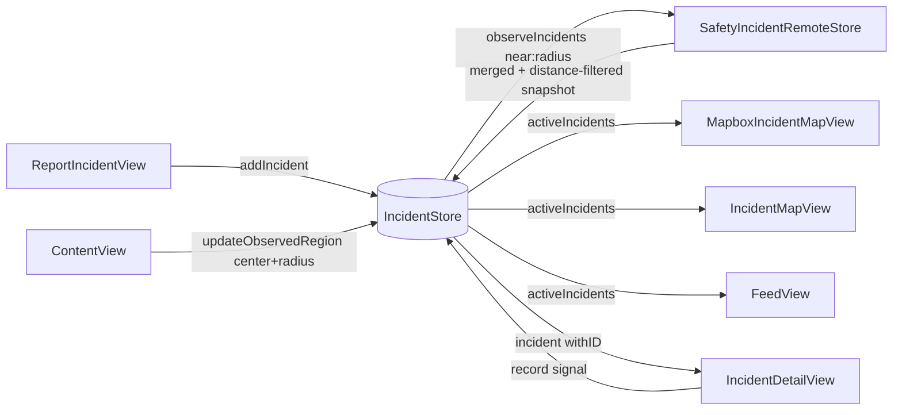
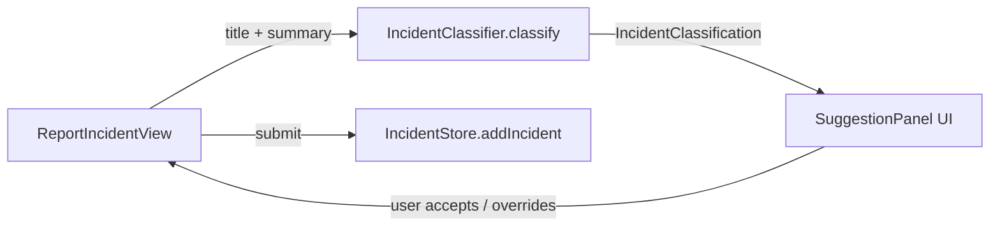

# PulseTrackr — Project Wiki

> Community safety incident reporter. Crowd-sourced reports, geo-bounded real-time map, Firebase backend. Built for global (multi-region) release: incidents are queried by proximity to the user, distances and copy localize per locale.

---

## Table of Contents

1. [Architecture Overview](#1-architecture-overview)
2. [Component Relationship Map](#2-component-relationship-map)
3. [File Reference](#3-file-reference)
4. [Data Model](#4-data-model)
5. [Data Flow](#5-data-flow)
6. [Shared State (AppStorage)](#6-shared-state-appstorage)
7. [Duplication & Efficiency Notes](#7-duplication--efficiency-notes)
8. [SOS Backend & Privacy Contract](#8-sos-backend--privacy-contract)
9. [Geo-scaling, Units & Localization](#9-geo-scaling-units--localization)

---

## 1. Architecture Overview

```
App Entry
  └── pulsetrackrApp          → boots Firebase → ContentView

ContentView (root)
  ├── owns IncidentStore      → injected to all tabs via .environmentObject
  └── tabs: Map | Feed | Report | Settings
        ├── PulseMapView      → delegates to Mapbox or Apple map
        ├── FeedView          → draggable sheet + embedded map
        ├── ReportIncidentView
        └── SettingsView

Data Layer
  ├── Incident.swift          → domain model (all enums + struct; optional coordinate)
  ├── IncidentStore           → @MainActor ObservableObject, CRUD, geo-region subscription
  ├── SafetyIncidentRemoteStore → Firestore geohash listeners + Functions submit/signal/query support
  ├── Geohash.swift           → standard geohash encode + neighbour/covering-cell logic for client listeners
  ├── SOSRemoteStore / SOSStore → Firebase Functions SOS activate/update/resolve + app-contact invites
  ├── SOSTrustedContact       → local trusted-contact model + Keychain helper + app route payload
  ├── SOSPrivacyPolicy        → client-side SOS sharing limits
  ├── IncidentClassifier      → keyword-based auto-classification
  ├── LocationManager         → shared CLLocationManager wrapper (persists last-known)
  └── MapDefaults             → shared initial-camera logic (last-known / world view)

External
  ├── Firebase Auth           → anonymous sign-in before submissions
  ├── Firebase Firestore      → safety_incidents_public plus private reports/counters/SOS/audit ledgers
  ├── Firebase Functions      → submit/signal/query incident callables + scheduled counter rollups + SOS/app-contact/legal callables
  ├── Firebase Storage        → incident photo/voice evidence, scoped to reporter uid
  ├── Twilio                  → optional trusted-contact SMS, voice, email, and STOP/START webhook
  └── Mapbox Maps SDK         → conditional compile (#if canImport(MapboxMaps))

Localization
  └── Localizable.xcstrings   → String Catalog (en source; es wired as example)
```

---

## 2. Component Relationship Map

### Ownership & Injection

```mermaid
graph TD
    App[pulsetrackrApp] -->|init| FB[FirebaseBootstrap]
    App -->|WindowGroup| CV[ContentView]

    CV -->|@StateObject owns| IS[IncidentStore]
    IS -->|optional dep| RS[SafetyIncidentRemoteStore]
    RS -->|uses| FB
    RS -->|Firebase Auth| Auth[Anonymous sign-in]
    RS -->|Firestore| FS[safety_incidents_public]
    RS -->|Functions| FN[submit_incident / record_incident_signal / record_incident_concern]
    SOSRS[SOSRemoteStore] -->|uses| FB
    SOSRS -->|Firebase Auth| Auth
    SOSRS -->|Functions| SOSFN[activate_sos / append_sos_location / resolve_sos / app contact invites]

    CV -->|@StateObject owns| LM[LocationManager]
    CV -->|.environmentObject| PMV[PulseMapView]
    CV -->|.environmentObject| FV[FeedView]
    CV -->|.environmentObject| RIV[ReportIncidentView]
    CV -->|.environmentObject| SV[SettingsView]
    CV -->|.environmentObject| LM

    PMV -->|#if Mapbox| MIMV[MapboxIncidentMapView]
    PMV -->|#else| IMV[IncidentMapView]
    FV -->|#if Mapbox| FML[FeedMapboxLayer]
    FV -->|#else| AppleMap[Apple Map inline]

    MIMV -->|NavigationLink| IDV[IncidentDetailView]
    IMV  -->|NavigationLink| IDV
    FV   -->|NavigationLink| IDV
```

### Read / Write on IncidentStore



### Classification Pipeline



`IncidentClassifier` is an **ordered, first-match-wins** rule chain (the order
encodes curated priority, e.g. `flooded road` → traffic *before* weather; `bad road`
→ before crash). Matching uses **left word-boundary prefix** matching (`\bterm`), so
inflections still match (`kidnap` → `kidnapping`) while embedded words do not
(`fire` inside `ceasefire`). Phrase lists include Nigerian/Pidgin variants
(`dey burn`, `fire outbreak`, `don collapse`, `go slow`, `PHCN`, `gbomo gbomo`, …);
malls/plazas/complexes are checked before markets so a "shopping complex fire" maps
to Building fire, not Market fire. No new subtypes were added. Covered by
`ClassifierNigerianTests.swift` plus the existing regression/validation suites.

---

## 3. File Reference

| File | Role | Key Types | Reads | Writes |
|------|------|-----------|-------|--------|
| `pulsetrackrApp.swift` | App entry | `pulsetrackrApp` | — | calls `FirebaseBootstrap` |
| `FirebaseBootstrap.swift` | Firebase init guard | `FirebaseBootstrap` | Bundle plist | `FirebaseApp.configure()` |
| `MapboxBootstrap.swift` | Mapbox access-token bootstrap | `MapboxBootstrap` | Generated app `Info.plist` (`MBXAccessToken`) | `MapboxOptions.accessToken` when Mapbox is linked |
| `ContentView.swift` | Root tab view; drives geo-region subscription from location + radius; sets the app-wide color scheme | `ContentView`, `AppTab` | `@AppStorage hasSeenLaunch/launchLastSeenAt/launchLastSeenVersion/watchRadius/lightModeEnabled`, `LocationManager` | calls `IncidentStore.updateObservedRegion`, `SOSStore.record`; `@AppStorage` welcome-seen keys |
| `LaunchView.swift` | Opening splash (`OpeningSplashView`) + first-run welcome (`LaunchView`) | `OpeningSplashView`, `LaunchView`, `FeatureRow` | — | `@AppStorage hasSeenLaunch` (+ reset keys) via callback |
| `PulseMapView.swift` | Map tab facade | `PulseMapView` | — | — |
| `MapboxIncidentMapView.swift` | Map (Mapbox) | `MapboxIncidentMapView` + 4 private views | `IncidentStore`, `LocationManager`, `@AppStorage watchRadius/urgentAlerts/communityAlerts` | — |
| `IncidentMapView.swift` | Map (Apple) | `IncidentMapView` + 5 private views | `IncidentStore`, `LocationManager`, `@AppStorage watchRadius/urgentAlerts/communityAlerts` | — |
| `FeedView.swift` | Feed tab + sheet | `FeedView` + 9 private views | `IncidentStore`, `LocationManager`, `@AppStorage watchRadius/urgentAlerts/communityAlerts` | — |
| `FeedMapboxLayer.swift` | Mapbox layer for Feed | `FeedMapboxLayer`, `FeedMapboxPin` | `[Incident]` passed in | — |
| `IncidentDetailView.swift` | Incident detail | `IncidentDetailView` + `detailPanel()` modifier | `IncidentStore.incident(withID:)` | `IncidentStore.record(_:for:)` |
| `ReportIncidentView.swift` | Report new incident — **single unified form** (text + optional photo + optional voice + ongoing/past toggle, all submitted together). Photo evidence can be **taken with the camera or chosen from the library** (`CameraPicker` + `PhotosPicker`) | `ReportIncidentView` + private views (`ReportComposer`, `CameraPicker`, `StatusPill`, `SuggestionPanel`, …) | `LocationManager`, `IncidentClassifier`, `@AppStorage useApproximateLocation` | `IncidentStore.addIncident(...)` |
| `IncidentEvidenceAttachment.swift` | Evidence upload value types | `IncidentEvidenceAttachment`, `UploadedIncidentEvidence` | photo/voice `Data` | Functions payload metadata after Storage upload |
| `SettingsView.swift` | Settings (incl. Appearance / light-mode toggle) | `SettingsView` + private views incl. `PrecisionLocationRow` | `@AppStorage` (5 keys), `LocationManager` (auth + accuracy), `SOSStore` | `@AppStorage` (5 keys) |
| `Incident.swift` | Domain model | `Incident`, `IncidentCategory`, `IncidentSubtype`, `IncidentSeverity`, `IncidentStatus`, `IncidentConfidence`, `CommunitySignal`, `IncidentUpdate` + `CLLocationCoordinate2D` extensions (`pulseDefaultCenter`, `isValid`, locale-aware distance) | — | — (value types) |
| `IncidentStore.swift` | State manager + geo-region subscription | `IncidentStore`; `Incident.seedIncidents` is **`#if DEBUG` only** (previews) | `SafetyIncidentRemoteStore` (optional) | self: in-place O(1) mutation via `lookup[UUID:Int]`; `@Published lastSyncError` |
| `SafetyIncidentRemoteStore.swift` | Firebase integration; geo-bounded feed plus generated contract DTO adoption | `SafetyIncidentRemoteStore`, `SafetyIncidentRemoteStoreError` | Firestore `safety_incidents_public` via per-prefix `geohash` range listeners | Functions `submit_incident`, `record_incident_signal`, `record_incident_concern`; Storage evidence |
| `Geohash.swift` | Geohash encode + neighbour/covering-cell + radius→precision | `Geohash` (enum) | — | — (pure) |
| `MapDefaults.swift` | Shared initial-camera logic | `MapDefaults` | `LocationManager.lastKnownCoordinate` | — |
| `SharedComponents.swift` | Reusable UI: `cardPanel()`, `CategoryChip`, `LocationPromptCard` | view modifier + 2 views | `CLAuthorizationStatus` | opens Settings / requests permission |
| `DesignSystem.swift` | Design tokens + brand (the `DS` enum: adaptive `DS.Color`, `DS.Font`, spacing/radius), shared `pulsePanel()`, button/field styles, severity ramp, and `PulseAppearance.apply()` for UIKit nav/tab chrome | `DS`, `PulseAppearance`, `DSPrimaryButtonStyle`, `DSSecondaryButtonStyle`, `DSSectionHeader`, `DSSeverityBadge` | `UITraitCollection` (adaptive light/dark colors) | UIKit appearance proxies |
| `AppStorageKey.swift` | Centralized `@AppStorage` key names | `AppStorageKey` enum | — | — |
| `SOSModels.swift` | Shared SOS client models | `SOSSession`, `SOSQueueEvent`, `SOSTrailPoint`, queue/delivery enums | — | value types for `SOSStore` and route UI |
| `SOSStore.swift` | SOS session/trail state machine + upload queue + app trusted-contact invite facade | `SOSStore` | `SOSRemoteStore`, `SOSTrustedContactStore`, `SOSPrivacyPolicy` | enqueues + syncs SOS events; `@Published` errors/app-contact list |
| `SOSOverlayView.swift` | In-app SOS activation/status overlay | `SOSOverlayView` | `SOSStore`, `LocationManager` | starts/stops SOS, retries queued updates |
| `SOSRoutePlaybackView.swift` | Recent SOS trail and upload-state view | `SOSRoutePlaybackView` | `SOSStore.trail`, queued event counts | retry queued SOS events |
| `SOSMapArtifacts.swift` | Map overlays for SOS trails and high-risk incidents | `IncidentDangerHalo`, `SOSTrailBreadcrumb`, `SOSLastKnownMarker` | `Incident`, `SOSMapTrailArtifact` | — |
| `Localizable.xcstrings` | String Catalog (en source; es example) | — | resolved by `Text`/`LocalizedStringKey` | — |
| `functions/src/geohash.js` | Server geohash encoder (matches `Geohash.swift`) | `encodeGeohash` | lat/lon | `geohash` field on public incidents |
| `storage.rules` | Storage access rules | — | Auth uid | reporter-owned image/audio only, ≤10 MB |
| `SOSRemoteStore.swift` | SOS Firebase Functions + app-alert API | `SOSRemoteStore`, `SOSActivationPayload`, `SOSLocationUpdatePayload`, `SOSResolutionPayload`, app trusted-contact invite/relationship/alert DTOs | Firebase configured state, `sos_app_alerts_private` for recipient-scoped alerts | Functions `activate_sos`, `append_sos_location`, `resolve_sos`, `create_app_trusted_contact_invite`, `accept_app_trusted_contact_invite`, `list_app_trusted_contacts` |
| `SOSTrustedContact.swift` | Local SOS contacts | `SOSTrustedContact`, `SOSTrustedContactStore`, notification target payloads | Keychain generic password item | Keychain generic password item; app route metadata when present |
| `SOSTrustedContactsView.swift` | Trusted-contact management UI | `SOSTrustedContactsView`, contact editor, contact picker | `SOSStore`, Contacts picker | local contacts, app invite create/accept calls |
| `SOSPrivacyPolicy.swift` | SOS sharing limits | `SOSPrivacyPolicy`, `SOSPayloadCoding` | — | — |
| `firebase.json` | Firebase backend config | Functions, Firestore, emulator config | — | deploy/emulator behavior |
| `firestore.rules` | Firestore access rules | server-only SOS collections | Auth/custom claims | denies raw SOS client reads |
| `functions/src/index.js` | Cloud Functions export surface | callables/webhooks re-exported from bounded modules | module exports | — |
| `functions/src/incidents/` | Incident callable and read-model module | `submit_incident`, `record_incident_signal`, `query_incidents_h3`, `rollupIncidentCounters`, `IncidentRepository` | callable payloads, H3 query cells, shared contract rules | `safety_incidents_public`, `safety_reports_private`, feed rate-limit collections, private counter shards/rollups |
| `functions/src/moderation/` | Moderation callable module | `record_incident_concern`, `ModerationRepository` | callable concern reports | `safety_incident_concerns_private`, public concern counters |
| `functions/src/sos/` | SOS callable module | `activate_sos`, `append_sos_location`, `resolve_sos`, app trusted-contact callables, `SOSRepository` | contract-shaped SOS payloads | private SOS session/location/app-alert/idempotency/rate-limit collections |
| `functions/src/disclosure/` | Privileged disclosure callable module | legal request intake/review/access, `DisclosureRepository` | custom claims, legal request payloads | legal request, access-grant, and audit collections |
| `functions/src/notifications/` | Notification domain module | trusted-contact fan-out and delivery summary helpers | SOS notification inputs | notification attempt records, Twilio provider APIs |
| `functions/src/shared/` | Backend shared adapters | Firebase Admin, callable config, audit/util/H3/privacy helpers | runtime config, Firestore timestamps | shared audit records/helpers |
| `functions/src/sosShared.js` | SOS backend validation helpers | payload sanitizers, idempotency helpers | callable payloads | pure values |
| `functions/src/notificationProviders.js` | SOS notification adapters | Twilio SMS, voice, and Comms Email | provider secrets | Twilio delivery APIs |
| `functions/src/twilioOptOut.js` | Twilio inbound opt-out helpers | STOP/START parser, phone hash, signature validator | Twilio webhook params | pure values |
| `functions/test/*.test.js` | Node backend tests | geohash, payload, H3/privacy, sharded counters, signal/concern, notification, SOS, Twilio opt-out suites | test fixtures/helpers | assertions only |
| `packages/contract/` | Shared contract package | Zod schemas, generated TS validators/types, generated Swift Codable DTOs, shared incident signal rules | contract source schemas | generated `app/Generated/PulseTrackrContract.generated.swift` |
| `docs/api/contract.md` | Generated API contract reference | incident/SOS/disclosure/notification schemas | `packages/contract` JSON Schema | regenerated by `npm run codegen` in `packages/contract` |
| `docs/adr/`, `docs/runbooks/` | Operational architecture records and runbooks | ADRs, Firebase/SOS/feed/secrets procedures | implemented backend/client behavior | operator guidance |
| `IncidentClassifier.swift` | Text classification | `IncidentClassifier`, `IncidentClassification` | title + summary strings | — (pure function) |
| `LocationManager.swift` | Location wrapper | `LocationManager` | `CLLocationManager` | publishes `currentCoordinate`, `authorizationStatus`, `accuracyAuthorization` (full vs reduced); persists last-known coord to `UserDefaults` |

---

## 4. Data Model

### Core Struct

```
Incident
 ├── id: UUID
 ├── title, summary, neighborhood: String
 ├── category: IncidentCategory   → color, icon, label
 ├── subtype: IncidentSubtype     → category, label, icon, isAlwaysHighRisk
 ├── severity: IncidentSeverity   → low / medium / high / urgent
 ├── status: IncidentStatus       → active / watching / resolved
 ├── coordinate: CLLocationCoordinate2D?  (k-anonymous public H3-cell center; nil = not revealed)
 ├── reporterCoordinate: CLLocationCoordinate2D?  (exact, private)
 ├── reportedAt: Date
 ├── confirmations, disputes, unsafeReports, blockedReports, clearedReports, officialUpdates: Int
 └── updates: [IncidentUpdate]    → { id, message, timestamp }
```

### Computed Properties on Incident

| Property | Logic |
|----------|-------|
| `confidence` | officialUpdates>0 → `.officialUpdate`; confirmations≥8 && disputes<confirmations → `.communityVerified`; confirmations≥2 or unsafe/blocked → `.multipleReports`; else → `.unconfirmed` |
| `isHighRisk` | severity == .urgent/.high OR subtype.isAlwaysHighRisk OR unsafeReports > 0 |
| `alertTone` | resolved → "No longer active"; isHighRisk → "Nearby alert sent"; else → "Live local report" |
| `signalSummary` | "X seen • X not seen • X unsafe • X cleared" |
| `hasLocation` | `coordinate?.isValid == true` — gates map pins and the directions UI |
| `googleMapsAreaURL` / `googleMapsDirectionsURL` | Built with `URLComponents` (no force-unwrap); fall back to the default center only when location is unknown (and the directions UI is hidden in that case) |

> **Note:** `coordinate` remains optional in the value model so old local values, previews, and defensive remote decoding can represent missing coordinates without fabricating a default pin. Real report submission is location-required: the report form needs a current or last-known coordinate, and `submit_incident` rejects missing, partial, or invalid latitude/longitude. The public `coordinate` is omitted until the H3 k-anonymity threshold is met; once revealed it is the H3 cell center, stamped with `public_h3_cell` and `geohash` server-side for proximity queries (see §9).

### Category → Subtype Hierarchy

```
security   → armedRobbery, kidnapping, gunshots, carjacking, oneChance,
             suspiciousActivity, checkpointIssue, communalClash
traffic    → crash, roadblock, gridlock, floodedRoad, badRoad, brokenDownVehicle
fire       → buildingFire, marketFire, gasLeak, explosion, electricalFire, pipelineFire
medical    → medicalEmergency, suspectedOutbreak, hospitalIssue, medicineShortage,
             contaminatedWater, foodPoisoning
weather    → flooding, heavyRain, stormDamage, erosionLandslide, droughtWaterScarcity
utilities  → powerOutage, waterOutage, fuelScarcity, bridgeDamage, railIssue
structure  → buildingCollapse, bridgeCollapse, roadCollapse, unsafeBuilding, fallenPowerLine
community  → missingPerson, localWarning, safeRoute, communityWatch,
             publicGathering, aidNeeded
```

**urgentTypes** (trigger urgent alert toggle): `security`, `fire`, `medical`  
**communityTypes** (trigger community alert toggle): `traffic`, `utilities`, `community`, `weather`, `structure`

---

## 5. Data Flow

### Reporting an Incident

One form collects everything at once — title/description, an optional photo, an
optional voice note, and an "Is this still happening?" choice (Happening now →
`status .active`; Already happened → `.watching`). The classifier suggestion panel
sits beneath and can be accepted or overridden. All filled inputs are merged into a
single `addIncident` call.

The photo control offers **two sources**: *Take Photo* (in-app camera via
`CameraPicker`, a thin `UIImagePickerController` wrapper) and *Choose from Library*
(`PhotosPicker`). A confirmation dialog picks between them; on devices/simulators
without a camera (`CameraPicker.isAvailable == false`) it falls straight through to
the library. Camera capture sets `selectedPhotoData` directly (bypassing the
`PhotosPicker → loadPhoto` path) and intentionally leaves `selectedPhotoItem`
untouched, since assigning it `nil` would re-fire `loadPhoto(nil)` and clear the
photo. The camera path requires `NSCameraUsageDescription`, set via
`INFOPLIST_KEY_NSCameraUsageDescription` in both build configs; the library path
needs no usage string (`PhotosPicker` runs out-of-process).

```
User types title/summary
  → IncidentClassifier.classify(title:summary:)        [pure, keyword match]
  → SuggestionPanel shows auto-classification
  → user accepts or manually overrides category/subtype/severity
  → LocationManager.currentCoordinate captured
  → IncidentStore.addIncident(...)
      ├── reportCoordinate = current location or last-known location (required by UI/backend)
      ├── publicCoordinate omitted until H3 k-anonymity threshold; revealed coordinate = public H3 cell center
      ├── append to incidents array (O(1) amortized)
      ├── update lookup[UUID → index]
      └── if remoteStore: Task { ... }
            ├── (best-effort) uploadIncidentEvidence(...)
            ├── retrying(3×, backoff) { submitIncident(...) }   ← no silent try?
            │     ├── ensureSignedIn() → Firebase anonymous auth
            │     └── functions.httpsCallable("submit_incident").call(payload)
            └── on failure → set IncidentStore.lastSyncError (surfaced to UI)
```

### Remote Sync (geo-bounded read model)

The feed is **proximity-bounded** — it no longer streams every incident worldwide
(critical for a global release). The current iOS listener path uses public geohash
prefix ranges; the backend also exposes `query_incidents_h3` for the Phase 4
hierarchical H3 feed read path. See §9 for the geo mechanics.

```
ContentView (on location fix or watchRadius change)
  └── IncidentStore.updateObservedRegion(center:, radiusKm:)   [re-subscribes if moved >500m or radius changed]
        └── SafetyIncidentRemoteStore.observeIncidents(near:, radiusMeters:) { incidents in }
              ├── Geohash.coveringPrefixes(center, radius)  → centre cell + 8 neighbours
              └── one snapshot listener per prefix:
                    safety_incidents_public
                      .order(by: geohash).start(at: prefix).end(before: prefix+"~").limit(200)
                  → on any listener change:
                      merge buckets → filter (active/watching AND distance ≤ radius) → sort by date
                      → replaceIncidents(...)  → rebuildLookup() [O(n)]

No location yet / permission denied → no subscription → empty feed + LocationPromptCard.
```

### Community Signal

```
IncidentDetailView → user taps signal button
  → IncidentStore.record(_:for:)
      ├── lookup[id] → index (O(1))
      ├── mutates incidents[index] in-place (no COW copy)   [optimistic UI only]
      ├── updates status, severity, counters
      ├── prepends IncidentUpdate to updates[]
      └── if remoteStore: Task { retrying(3×) { recordSignal(signal, forIncidentWithID:) } }
            └── functions.httpsCallable("record_incident_signal").call({ incident_id, signal })
```

The public feed is **read-only to clients** (`firestore.rules`), so signals route
through the `record_incident_signal` callable — the client never writes the counters
or status/severity directly. The function increments the matching private counter
shard, reads shard totals for state derivation, and **derives status/severity
server-side** (`deriveSignalOutcome`, shared from the contract foundation), so a
client cannot forge them. `rollupIncidentCounters` periodically projects shard
totals back onto `safety_incidents_public`, making public counters eventually
consistent while keeping the write path hot-spot resistant. Resolved incidents are
no-ops, and signals are per-user rate-limited (2 s cooldown, 120/hr). The local
mutation above is purely optimistic; the geohash listener later reconciles to server
truth. The `roadBlocked` rule only *raises* a Low incident's floor to Medium — it
never downgrades a higher severity (closing a severity-suppression vector).

### Feed/Map Filtering Pipeline

```
(incidents already proximity-bounded server-side to the watch radius — see §9)
IncidentStore.activeIncidents          [status != resolved, sorted by date]
  → IncidentStore.nearbyIncidents(urgentAlerts:communityAlerts:watchRadius:near:)
       ├── classify: urgent = category ∈ urgentTypes OR incident.isHighRisk;
       │            community notice = (not urgent) AND category ∈ communityTypes
       ├── filter by urgentAlerts / communityAlerts (@AppStorage)
       └── filter by watchRadius * 1000m from locationManager.currentCoordinate
           (locationless incidents are excluded from the radius filter)
  → [FeedView] scope filter: all / priority / new / verified
  → [FeedView] category chip filter
  → [FeedView] search text filter (title, summary, neighborhood, category, subtype)

Distances shown to the user format per locale (m/km vs ft/mi) — see §9.
Map pins are only drawn for incidents with a non-nil coordinate.
```

---

## 6. Shared State (AppStorage)

These keys are read/written across multiple files. Changing a key name requires updating all sites.

| Key | Type | Default | Read by | Written by |
|-----|------|---------|---------|------------|
| `hasSeenLaunch` | Bool | false | `ContentView` | `ContentView` (via `LaunchView` callback) |
| `launchLastSeenAt` | Double | 0 | `ContentView` | `ContentView` (on welcome dismiss) |
| `launchLastSeenVersion` | String | "" | `ContentView` | `ContentView` (on welcome dismiss) |
| `watchRadius` | Double | 3.0 | `FeedView`, `IncidentMapView`, `MapboxIncidentMapView`, `SettingsView` | `SettingsView` |
| `urgentAlerts` | Bool | true | `FeedView`, `IncidentMapView`, `MapboxIncidentMapView`, `SettingsView` | `SettingsView` |
| `communityAlerts` | Bool | true | `FeedView`, `IncidentMapView`, `MapboxIncidentMapView`, `SettingsView` | `SettingsView` |
| `useApproximateLocation` | Bool | true | `ReportIncidentView`, `SettingsView` | `SettingsView` |
| `lightModeEnabled` | Bool | false | `ContentView`, `SettingsView` | `SettingsView` |
| `lastKnownLatitude` | Double | — | `LocationManager.lastKnownCoordinate` (→ `MapDefaults`, map camera init) | `LocationManager` (on each GPS fix) |
| `lastKnownLongitude` | Double | — | `LocationManager.lastKnownCoordinate` (→ `MapDefaults`, map camera init) | `LocationManager` (on each GPS fix) |

> Key names are centralized in `AppStorageKey.swift`. `watchRadius` is stored
> canonically in **km**; the Settings label converts to mi for imperial locales.

### Welcome screen re-display

The first-run welcome (`LaunchView`) is gated by three keys, not just
`hasSeenLaunch`. `ContentView.shouldShowWelcome` re-shows it when the user has never
seen it, when `launchLastSeenVersion` ≠ the current `version-build`, or when
`launchLastSeenAt` is older than **30 days** (`welcomeResetInterval`). Dismissal
(`markWelcomeSeen`) sets all three **without** wrapping the `LaunchView → mainTabs`
swap in `withAnimation` — animating that view-identity change while `LaunchView`'s
`.repeatForever` pulse is live could wedge the transition and freeze the UI.

### Appearance (dark-default theming)

`ContentView` declares `.preferredColorScheme(lightModeEnabled ? .light : .dark)` at
the **root**, so the first rendered frame is dark — there is no system-light flash on
launch. `lightModeEnabled` defaults to `false` (dark) and is toggled from Settings →
Appearance. The immersive **map and feed keep their own `.preferredColorScheme(.dark)`
override** (they sit on a dark map surface with literal black/white chrome), so the
light theme applies to the adaptive surfaces — Settings, Report, Incident detail, SOS
— while the map stays dark by design. Adaptive colors live in `DS.Color` (see
`DesignSystem.swift`); the UIKit nav/tab chrome adapts via
`UI*Appearance.configureWithDefaultBackground()` in `PulseAppearance.apply()`.

---

## 7. Duplication & Efficiency Notes

### ✅ Resolved — Shared Filter Logic

The urgentAlerts + communityAlerts + watchRadius + distance filter now lives in
`IncidentStore.nearbyIncidents(urgentAlerts:communityAlerts:watchRadius:near:)`.
`FeedView`, `IncidentMapView`, and `MapboxIncidentMapView` all call that single
method, so filter changes propagate everywhere automatically.

---

### ✅ Resolved — Shared LocationManager

`ContentView` owns one `@StateObject private var locationManager = LocationManager()` and injects it as an environment object. `MapboxIncidentMapView`, `IncidentMapView`, `FeedView`, and `ReportIncidentView` read that shared instance instead of creating separate `CLLocationManager` wrappers.

---

### 🟡 Medium — Near-Duplicate Pin Views

`FeedMapboxPin` (`FeedMapboxLayer.swift`) and `MapboxIncidentPin` (`MapboxIncidentMapView.swift`) render the same pin design with slightly different sizing constants.  
`FeedMapPin` (`FeedView.swift`) and `LiveIncidentPin` (`IncidentMapView.swift`) are also near-identical for Apple Maps.

**Fix:** Consolidate into one `IncidentPin(incident:, style:)` view, parameterized by `PinStyle` enum (compact / standard / large).

---

### 🟡 Medium — Panel View Modifier Triplication

Three nearly identical `.background + .overlay(stroke)` modifiers exist as private extensions with different opacities:

- `detailPanel()` in `IncidentDetailView.swift` — 0.07 / 0.06
- `reportPanel()` in `ReportIncidentView.swift` — 0.09 / 0.06
- `settingsPanel()` in `SettingsView.swift` — 0.07 / 0.06

**Fix:** One shared `func cardPanel(backgroundOpacity: Double = 0.07)` view modifier in a shared file (e.g., `ViewModifiers.swift`).

---

### 🟡 Medium — CategoryChip Duplication

`CategoryChip` in `FeedView.swift` and `MapboxCategoryChip` in `MapboxIncidentMapView.swift` are the same component with only background color differences (white vs black).

**Fix:** One `CategoryChip(title:icon:color:isSelected:darkBackground:action:)` with a `darkBackground` bool.

---

### ✅ Resolved — `Incident.seedIncidents` no longer ships

Seed data was previously the production store's initial state (5 fake incidents
shown to every user on launch). It is now wrapped in `#if DEBUG` and used only by
SwiftUI previews via `IncidentStore.preview`. The production store starts **empty**
and fills from the geo-bounded remote listener. `#Preview` blocks that reference it
are themselves `#if DEBUG` (since `#Preview` macros compile into release builds).

---

### ✅ Resolved — Other audited items

- **No fabricated location.** The client and backend require a real current or
  last-known report coordinate for submission. The optional coordinate field still
  decodes defensively as `nil` rather than a default-city pin for old/local data;
  pins/distance/directions gate on `coordinate`/`hasLocation`.
- **No silent network failures.** `submitIncident`/`recordSignal` retry with backoff
  and surface `IncidentStore.lastSyncError`; SOS `markNotified` failures surface via
  `trustedContactError` (previously `try?`-swallowed).
- **Magic coordinate de-duplicated** into `CLLocationCoordinate2D.pulseDefaultCenter`
  (now only a deep fallback; map cameras use `MapDefaults`).
- **Force-unwrapped Google Maps URLs** replaced with `URLComponents`.
- **`GoogleService-Info.plist` untracked** from git (`.gitignore` + committed
  `.example` template); protect the API key via Cloud Console restrictions + rules.

---

### ✅ Resolved — Public-feed abuse hardening

The public community feed is the only client-influenced surface, so both write
paths are now server-gated:

- **Report spam** — `submit_incident` enforces a per-user rate limit (15 s cooldown,
  20/hr) inside its write transaction, counters held in the rules-locked
  `safety_feed_rate_limits_private` collection (TTL via `deleteAfter`).
- **Signal trust** — community confirm/dispute previously did a direct Firestore
  `updateData` (silently denied by `allow write: if false`). It now flows through the
  `record_incident_signal` callable, which owns the private shard increment and
  derives status/severity itself — clients can no longer set them. Public counter
  fields are projected by `rollupIncidentCounters` instead of being hot-spotted on
  every signal. Same rate-limit pattern (2 s / 120 hr). The `roadBlocked` rule was
  also corrected to only raise (never lower) severity. Covered by
  `functions/test/incidentSignal.test.js`.
- **Moderation concerns** — "Report concern" routes through `record_incident_concern`,
  which validates the reason, rate-limits the caller, writes
  `safety_incident_concerns_private`, and increments public concern metadata for
  operations review. Clients do not write moderation fields directly.

---

### 🟢 Low — `IncidentDetailView` Always Fetches Live Incident

`IncidentDetailView` takes an `Incident` parameter but immediately replaces it with `incidentStore.incident(withID:)` on every body evaluation. This is intentional for live updates but means the passed-in incident is only used as a fallback.

**Consider:** Passing only the UUID instead of the full `Incident` struct to make the intent clearer.

---

### Notes on What's Already Efficient

- `IncidentStore` uses `lookup: [UUID: Int]` for O(1) incident access — good
- In-place mutation via `objectWillChange.send()` + direct index access avoids copy-on-write overhead — good
- `SafetyIncidentRemoteStore.makeIfConfigured()` gracefully no-ops without Firebase plist — good
- `IncidentClassifier` is a pure function (no state) — good
- `FirebaseBootstrap` guards against double-configure — good

---

## 8. SOS Backend & Privacy Contract

SOS support is intentionally split from incident reporting. Trusted contacts are stored locally through `SOSTrustedContactStore`, and remote SOS calls are only available through `SOSRemoteStore.makeIfConfigured()` when `GoogleService-Info.plist` is present. That plist is **git-ignored** (each developer supplies their own; see `GoogleService-Info.plist.example` and `FIREBASE_SETUP.md`).

App-to-app trusted contacts are explicit and directional. If User A creates an app invite and User B accepts it, the backend stores only `A -> B`: A's SOS can create an app-visible alert for B, but B's SOS cannot alert A through that relationship. The reverse direction requires B to create a separate invite and A to accept it.

### Client payloads

`activate_sos` receives:

- `client_session_id`, `activated_at`, and `source`
- `last_known_location`
- privacy-capped `recent_trail`
- optional `direction_of_travel`
- `trusted_contacts_to_notify` for backend notification attempts
- `device` metadata where locally available, including battery, low-power mode, app/build, device/system, and optional network state
- `privacy` policy values that document client sharing limits

`append_sos_location` receives `session_id`, one location snapshot, sequence number, optional direction of travel, and current device metadata.

`resolve_sos` receives `session_id`, `resolution_reason`, `resolved_at`, and an optional final location.

App trusted-contact callables:

- `create_app_trusted_contact_invite`: owner creates a short-lived code for one trusted contact.
- `accept_app_trusted_contact_invite`: recipient accepts the code and creates the one-way relationship.
- `list_app_trusted_contacts`: returns outgoing relationships that this user can alert and incoming relationships that can alert this user.
- `revoke_app_trusted_contact`: either side can revoke an accepted relationship.

### Backend collections

- `sos_sessions_private`: server-only active/resolved session records.
- `sos_location_updates_private`: server-only append-only live update records, with retention/TTL.
- `sos_notification_attempts_private`: trusted-contact notification attempts, updated with `sent`, `failed`, or `provider_unconfigured`.
- `sos_notification_tasks_private`: Cloud Tasks saga state for asynchronous SOS notification fan-out.
- `sos_notification_dlq_private`: terminal notification task failures with redacted payload/error context for operations follow-up.
- `sos_sms_opt_outs_private`: hashed-phone STOP/START ledger for trusted-contact SMS opt-outs, written only by the Twilio webhook path.
- `sos_app_trusted_contact_invites_private`: server-only short-lived one-way app invite records.
- `sos_app_trusted_contacts_private`: server-only accepted one-way app relationships.
- `sos_app_alerts_private`: app-readable SOS alert records scoped by `recipientUid == request.auth.uid`; writes are server-only.
- `sos_idempotency_private`: maps user + client session UUID to the canonical server session.
- `sos_rate_limits_private`: per-user activation cooldown/window tracking.
- `sos_access_grants_private`: short-lived privileged grants for authorized responder/admin flows.
- `sos_law_enforcement_requests_private`: company-controlled legal request intake/review records tied to a specific SOS session.
- `sos_access_audit`: hash-chained, append-only audit events for admin, care-team, and law-enforcement access attempts. Audit collection reads are limited to internal `sosAdmin`/`careTeam` users; law-enforcement disclosure status stays scoped through backend functions.
- `safety_incident_concerns_private`: private moderation reports created by `record_incident_concern`.

### Access limits

Law-enforcement and admin access must be audited, time-limited, and restricted to active SOS sessions. PulseTrackr should not imply automatic law-enforcement dispatch. Any law-enforcement access requires a recorded legal request, internal `sosAdmin` approval, a matching `legal_request_id`, active-session verification, minimum scoped disclosure, and audit records in `sos_access_audit`.

### Backend delivery implementation

The Firebase backend now lives in this repo:

- `firebase.json` configures Firestore rules/indexes, Storage rules, and local emulators for Auth, Functions, and Firestore.
- `firestore.rules` denies direct client access to raw SOS location/session/notification/task/DLQ/idempotency/rate-limit collections, audit chain heads, disclosure key releases, role-claim ledgers, `safety_feed_rate_limits_private`, and private concern records. `safety_incidents_public` is client-readable but client-unwritable: new reports go through `submit_incident`, community signals go through `record_incident_signal`, and concern reports go through `record_incident_concern`.
- `storage.rules` scopes incident evidence to `incident_reports/{uid}/…`: the owner may create image/audio ≤10 MB; everything else denied.
- `functions/src/index.js` is now the export surface; callable implementations live in bounded modules with handler/domain/repository boundaries:
  - `submit_incident`: auth/App Check, payload sanitization, **per-user rate limit** (15 s cooldown, 20/hr via `safety_feed_rate_limits_private`), exact write to `safety_reports_private`, H3 metadata on the private report, and public coordinate/geohash reveal only after the k-anonymous H3 threshold is met.
  - `record_incident_signal`: auth/App Check, per-user rate limit (2 s cooldown, 120/hr), server-authoritative private counter-shard increment + status/severity derivation (`deriveSignalOutcome`); the only write path to the read-only public feed. No-op on resolved incidents.
  - `rollupIncidentCounters`: scheduled every 5 minutes; folds private counter shards into the public read model and writes a private rollup record for operations review.
  - `query_incidents_h3`: authenticated hierarchical H3 feed query for the scalable backend read path; queries revealed public H3 cells, filters expired/resolved incidents, and returns contract-shaped public incident summaries plus query metadata.
  - `record_incident_concern`: auth/App Check, supported moderation reasons, per-user rate limit, private concern record, and public concern counter/timestamp update.
  - `activate_sos`: auth/App Check, idempotency, rate limits, server-side trail caps, encrypted private session location/trail write, chained audit write, and Cloud Tasks enqueue for notification fan-out.
  - `append_sos_location`: auth/App Check, owner check, active/unexpired session check, idempotent encrypted sequence updates, append-only update records, and app alert live-location refresh.
  - `resolve_sos`: auth/App Check, owner check, supported resolution reasons, idempotent encrypted final-location resolution, chained audit write, and app alert resolution.
  - `create_app_trusted_contact_invite`, `accept_app_trusted_contact_invite`, `list_app_trusted_contacts`, `revoke_app_trusted_contact`: explicit one-way app trusted-contact workflow.
  - `twilio_sms_webhook`: signed Twilio inbound-message webhook for STOP/START/HELP handling; writes hashed opt-out status and lets future SMS attempts skip opted-out contacts.
  - `record_law_enforcement_request`: `sosAdmin`/`careTeam` intake for legal requests without location disclosure.
  - `review_law_enforcement_request`: `sosAdmin` approval/denial for scoped, expiring law-enforcement access.
  - `request_sos_session_access`: custom-claim gated access for `sosAdmin`, `careTeam`, or `lawEnforcement`, active-session only, chained audit, short-lived grants, and disclosure key-release ledger records. The `lawEnforcement` role must include an approved matching `legal_request_id`.
  - `mint_sos_role_claim` / `revoke_sos_role_claim`: `sosAdmin`-only audited custom-claim management with role expiry metadata and a private grant ledger.
- `processSosNotifications`: Cloud Tasks worker for SOS notification fan-out. It retries provider/app-alert delivery using task queue retry policy, marks completed sessions with `notificationSagaStatus = completed`, and writes terminal failures to `sos_notification_dlq_private` while compensating the session with `notificationSagaStatus = failed`.
- `packages/contract` is the cross-platform source of truth for incident/SOS/disclosure/notification payload schemas and incident state transitions. Its codegen emits Swift Codable DTOs used by the iOS remote stores and TS/Zod validators used by the Functions build.
- `docs/api/contract.md` is generated from the contract JSON Schema by `packages/contract/codegen/generate-api-docs.cjs`; CI fails if the generated docs drift.
- `docs/adr/` records the contract, privacy, resilience, and scaled read-model decisions; `docs/runbooks/` covers Firebase deploys, incident feed operations, SOS operations, and secret rotation.
- `.github/workflows/phase1-contract.yml` gates the contract foundation with codegen drift checks, Functions build/tests, Firestore rules emulator tests, and an iOS simulator build.
- `functions/src/sosShared.js` keeps the validation logic pure and covered by `node --test`.
- `functions/src/notificationProviders.js` sends SMS, phone calls, and email through Twilio when credentials are configured. Missing credentials are recorded as `provider_unconfigured`, never as a successful alert.
- The iOS client writes report, signal, concern, SOS activate/location/resolve actions to a durable JSON outbox under Application Support and drains it on launch/foreground. SOS also persists its local session/trail/queue snapshot so replay survives app termination.

Production still needs provider secrets, `SOS_ENVELOPE_KEK`, sender verification, delivery-receipt monitoring, and a documented incident-response owner before any live SOS launch. The code path is now real, but operations must be real too.

### Firebase project state

The local Firebase CLI can see the `pulsetracker-0000` Firebase project, and `.firebaserc` maps `default`/`production` to that project. The live project currently has existing Python functions, so this repo uses the separate Functions codebase `pulsetrackr-sos` for SOS to avoid deleting or reconciling unrelated deployed functions. A deploy still requires intentional operator action:

```sh
firebase deploy --only functions:pulsetrackr-sos,firestore:rules,firestore:indexes,storage --project pulsetracker-0000
```

Before deploy, configure Twilio secrets with `firebase functions:secrets:set`:
`TWILIO_ACCOUNT_SID`, `TWILIO_API_KEY_SID`, `TWILIO_API_KEY_SECRET`,
`TWILIO_AUTH_TOKEN`, `TWILIO_FROM_NUMBER`, and `TWILIO_EMAIL_FROM_ADDRESS`.
Also configure `SOS_ENVELOPE_KEK` with `firebase functions:secrets:set`; generate
it with `openssl rand -base64 32` and rotate by adding a new Secret Manager
version plus a new `SOS_ENVELOPE_KEY_VERSION`, deploying, verifying decrypt/release,
and disabling the old version after the SOS retention window.
Use `TWILIO_EMAIL_FROM_NAME`, `TWILIO_VOICE_TWIML`, and
`TWILIO_WEBHOOK_PUBLIC_URL` as non-secret environment overrides when needed, then
assign custom responder claims through `mint_sos_role_claim`; keep
`functions/scripts/setSosRoleClaim.js` for bootstrap/break-glass only.

---

## 9. Geo-scaling, Units & Localization

Groundwork for a public, multi-region release.

### Geo-bounded incident feed (H3 + geohash)

The app does **not** stream every incident worldwide. Each revealed public incident
carries a public H3 cell plus a standard geohash derived from the k-anonymous H3
cell center, and clients query only cells around the user.

- **Write side** — `submit_incident` stores exact coordinates only in
  `safety_reports_private`, computes private H3 cells, and writes public
  `latitude`/`longitude`/`geohash` only when at least `k` distinct reporters are
  present in the cell (default `k=3`, resolution 8 with resolution 7 fallback).
  The public coordinate is the H3 cell center. The public doc also carries
  `public_h3_cell`, `public_h3_resolution`, and a `geohash` encoded through
  `functions/src/geohash.js`, byte-for-byte compatible with the client encoder in
  `app/Geohash.swift`.
- **Read side, current iOS listener** — `Geohash.coveringPrefixes(lat, lon, radiusMeters)`
  picks a precision sized to the watch radius and returns the centre cell + its 8
  neighbours. `SafetyIncidentRemoteStore.observeIncidents(near:radiusMeters:)`
  attaches one listener per prefix as a `geohash` range query `[prefix, prefix+"~")`,
  merges the buckets, then filters to the exact radius + active statuses on the client.
- **Read side, Phase 4 backend query** — `query_incidents_h3` expands the user's
  center/radius into bounded resolution-8 and resolution-7 H3 cells, queries
  `safety_incidents_public.public_h3_cell`, filters expired/resolved results, and
  returns a compact incident list plus query metadata. This gives the backend an
  explicit scalable read path while the app can continue using geohash listeners
  until it is swapped over.
- **Re-subscription** — driven by `ContentView`; re-subscribes when the user moves
  >500 m or changes `watchRadius`.
- **Index** — public reads order by the single `geohash` field (auto-indexed).
  The backend H3 query uses the composite `public_h3_cell/deleteAfter` index.
  Private reveal checks use composite indexes on `privateH3Cell/deleteAfter` and
  `privateH3ParentCell/deleteAfter`. Counter shard reads use the private shard index
  declared in `firestore.indexes.json`; rollup queue ordering uses Firestore's
  single-field `updatedAt` index with TTL declared as a field override.
- **Backfill** — docs without a revealed `geohash` are skipped by geo-queries.
  Do not backfill old exact coordinates into the public feed; let TTL expire them
  or migrate them through the H3/k-anonymity policy.

> **⚠️ Deploy gotcha (client/backend version skew).** The client query is
> `order(by: "geohash")`, which Firestore **excludes any document missing that
> field** from. So the geo-feed only works once `submit_incident` is **deployed**
> (`firebase deploy --only functions:pulsetrackr-sos:submit_incident`) — shipping
> the app to TestFlight does *not* deploy the backend. Symptom of the skew: a
> reported incident never appears in the reporter's own feed/map because its doc has
> no `geohash`. Confirm by checking a doc in `safety_incidents_public` for a
> `geohash` field. `sanitizeIncidentPayload` now rejects missing, partial, or
> invalid coordinates rather than inventing a fallback pin.

**Data-visibility consequence:** users only see incidents within their watch radius
(default 3 km, max 15 km) of their *own* location. No cross-country data; users in
different cities see different alerts; two users share an alert only where their
radii overlap.

### Locale-aware units

`CLLocationCoordinate2D.formattedDistance`/`shortFormattedDistance` branch on
`Locale.current.measurementSystem` → m/km for metric, ft/mi for imperial. The
Settings watch-radius label converts km→mi for imperial locales (stored value stays
km).

### Localization

`app/Localizable.xcstrings` (String Catalog) is the translation source.
`SWIFT_EMIT_LOC_STRINGS = YES` auto-extracts literal `Text("…")` strings. English is
the development language; `es` is wired end-to-end as a worked example (a build
emits `es.lproj/Localizable.strings`). String *variables* must be typed
`LocalizedStringKey` to localize (see `LocationPromptCard`). Full migration is
incremental — see `LOCALIZATION.md`.

### Location permission & accuracy

`LocationManager` publishes `authorizationStatus` and `accuracyAuthorization`
(`.fullAccuracy` vs `.reducedAccuracy`). Settings → Privacy shows a
`PrecisionLocationRow` reflecting this (green when full accuracy, orange + a
Settings shortcut when reduced or unauthorized). Reduced accuracy still yields a
coarse coordinate (so the geo-feed works, just less precisely); only a *missing*
fix at report time (or denial) prevents reporting. The app disables report submit
until it has a current or last-known coordinate, and the backend rejects any report
without a valid lat/long pair.

### Initial map camera

All four maps share `MapDefaults`:
- Returning user (saved last-known location) → opens on that area at city zoom.
- Brand-new user (no saved location) → opens on a flat zoomed-out **world view**
  (not an arbitrary city), then animates to the user on first GPS fix.
- No location + permission undetermined/denied → `LocationPromptCard` overlay.

### Validation

- `pulsetrackrTests/GeohashTests.swift` — encoder round-trip, neighbour reciprocity,
  and full circle-coverage (no edge misses).
- `functions/test/geohash.test.js` — server encoder agrees with the client.
- `functions/test/privacyPrimitives.test.js` — H3 k-anonymity metadata, bounded
  H3 query expansion, and envelope encryption behavior.
- `functions/test/incidentSignal.test.js` — signal state transitions and private
  counter-shard rollup totals.
- `functions/test/geoQuery.emulator.js` (`npm run test:geo`) — end-to-end against the
  **Firestore emulator**: nearby active incidents returned, far/other-continent and
  resolved excluded, widening the radius pulls in the edge incident.
