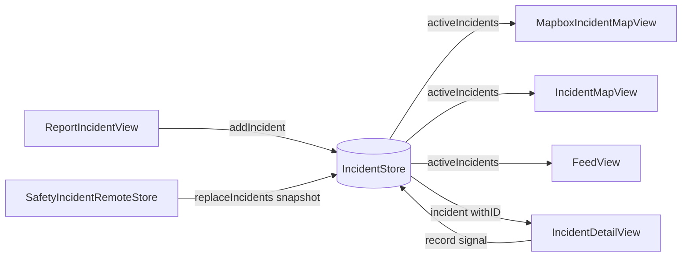
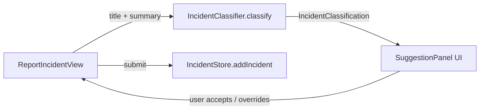

# PulseTrackr — Project Wiki

> Community safety incident reporter for Lagos. Crowd-sourced reports, real-time map, Firebase backend.

---

## Table of Contents

1. [Architecture Overview](#1-architecture-overview)
2. [Component Relationship Map](#2-component-relationship-map)
3. [File Reference](#3-file-reference)
4. [Data Model](#4-data-model)
5. [Data Flow](#5-data-flow)
6. [Shared State (AppStorage)](#6-shared-state-appstorage)
7. [Duplication & Efficiency Notes](#7-duplication--efficiency-notes)

---

## 1. Architecture Overview

```
App Entry
  └── pulsetrackrApp          → boots Firebase → ContentView

ContentView (root)
  ├── owns IncidentStore      → injected to all tabs via .environmentObject
  └── tabs: Map | Feed | Report | Settings
        ├── PulseMapView      → delegates to Mapbox or Apple map
        ├── FeedView          → draggable sheet + embedded map
        ├── ReportIncidentView
        └── SettingsView

Data Layer
  ├── Incident.swift          → domain model (all enums + struct)
  ├── IncidentStore           → @MainActor ObservableObject, CRUD, seed data
  ├── SafetyIncidentRemoteStore → Firebase Firestore listener + Functions submit
  ├── IncidentClassifier      → keyword-based auto-classification
  └── LocationManager         → CLLocationManager wrapper (3 separate instances)

External
  ├── Firebase Auth           → anonymous sign-in before submissions
  ├── Firebase Firestore      → safety_incidents_public collection (snapshot listener)
  ├── Firebase Functions      → submit_incident callable
  └── Mapbox Maps SDK         → conditional compile (#if canImport(MapboxMaps))
```

---

## 2. Component Relationship Map

### Ownership & Injection

```mermaid
graph TD
    App[pulsetrackrApp] -->|init| FB[FirebaseBootstrap]
    App -->|WindowGroup| CV[ContentView]

    CV -->|@StateObject owns| IS[IncidentStore]
    IS -->|optional dep| RS[SafetyIncidentRemoteStore]
    RS -->|uses| FB
    RS -->|Firebase Auth| Auth[Anonymous sign-in]
    RS -->|Firestore| FS[safety_incidents_public]
    RS -->|Functions| FN[submit_incident]

    CV -->|.environmentObject| PMV[PulseMapView]
    CV -->|.environmentObject| FV[FeedView]
    CV -->|.environmentObject| RIV[ReportIncidentView]
    CV -->|.environmentObject| SV[SettingsView]

    PMV -->|#if Mapbox| MIMV[MapboxIncidentMapView]
    PMV -->|#else| IMV[IncidentMapView]
    FV -->|#if Mapbox| FML[FeedMapboxLayer]
    FV -->|#else| AppleMap[Apple Map inline]

    MIMV -->|NavigationLink| IDV[IncidentDetailView]
    IMV  -->|NavigationLink| IDV
    FV   -->|NavigationLink| IDV

    MIMV -->|@StateObject owns| LM1[LocationManager ①]
    IMV  -->|@StateObject owns| LM2[LocationManager ②]
    FV   -->|@StateObject owns| LM3[LocationManager ③]
    RIV  -->|@StateObject owns| LM4[LocationManager ④]
```

### Read / Write on IncidentStore



### Classification Pipeline



---

## 3. File Reference

| File | Role | Key Types | Reads | Writes |
|------|------|-----------|-------|--------|
| `pulsetrackrApp.swift` | App entry | `pulsetrackrApp` | — | calls `FirebaseBootstrap` |
| `FirebaseBootstrap.swift` | Firebase init guard | `FirebaseBootstrap` | Bundle plist | `FirebaseApp.configure()` |
| `ContentView.swift` | Root tab view | `ContentView`, `AppTab` | `@AppStorage hasSeenLaunch` | — |
| `LaunchView.swift` | Onboarding splash | `LaunchView`, `FeatureRow` | — | `@AppStorage hasSeenLaunch` via callback |
| `PulseMapView.swift` | Map tab facade | `PulseMapView` | — | — |
| `MapboxIncidentMapView.swift` | Map (Mapbox) | `MapboxIncidentMapView` + 4 private views | `IncidentStore`, `LocationManager`, `@AppStorage watchRadius/urgentAlerts/communityAlerts` | — |
| `IncidentMapView.swift` | Map (Apple) | `IncidentMapView` + 5 private views | `IncidentStore`, `LocationManager`, `@AppStorage watchRadius/urgentAlerts/communityAlerts` | — |
| `FeedView.swift` | Feed tab + sheet | `FeedView` + 9 private views | `IncidentStore`, `LocationManager`, `@AppStorage watchRadius/urgentAlerts/communityAlerts` | — |
| `FeedMapboxLayer.swift` | Mapbox layer for Feed | `FeedMapboxLayer`, `FeedMapboxPin` | `[Incident]` passed in | — |
| `IncidentDetailView.swift` | Incident detail | `IncidentDetailView` + `detailPanel()` modifier | `IncidentStore.incident(withID:)` | `IncidentStore.record(_:for:)` |
| `ReportIncidentView.swift` | Report new incident | `ReportIncidentView` + 9 private views | `LocationManager`, `IncidentClassifier`, `@AppStorage useApproximateLocation` | `IncidentStore.addIncident(...)` |
| `SettingsView.swift` | Settings | `SettingsView` + 4 private views | `@AppStorage` (4 keys) | `@AppStorage` (4 keys) |
| `Incident.swift` | Domain model | `Incident`, `IncidentCategory`, `IncidentSubtype`, `IncidentSeverity`, `IncidentStatus`, `IncidentConfidence`, `CommunitySignal`, `IncidentUpdate` + `CLLocationCoordinate2D` extensions | — | — (value types) |
| `IncidentStore.swift` | State manager + seed data | `IncidentStore` + `Incident.seedIncidents` extension | `SafetyIncidentRemoteStore` (optional) | self: in-place O(1) mutation via `lookup[UUID:Int]` |
| `SafetyIncidentRemoteStore.swift` | Firebase integration | `SafetyIncidentRemoteStore`, `SafetyIncidentRemoteStoreError` | Firestore `safety_incidents_public` | Firestore via `submit_incident` Function |
| `IncidentClassifier.swift` | Text classification | `IncidentClassifier`, `IncidentClassification` | title + summary strings | — (pure function) |
| `LocationManager.swift` | Location wrapper | `LocationManager` | `CLLocationManager` | publishes `currentCoordinate`, `authorizationStatus` |

---

## 4. Data Model

### Core Struct

```
Incident
 ├── id: UUID
 ├── title, summary, neighborhood: String
 ├── category: IncidentCategory   → color, icon, label
 ├── subtype: IncidentSubtype     → category, label, icon, isAlwaysHighRisk
 ├── severity: IncidentSeverity   → low / medium / high / urgent
 ├── status: IncidentStatus       → active / watching / resolved
 ├── coordinate: CLLocationCoordinate2D   (fuzzy public coord)
 ├── reporterCoordinate: CLLocationCoordinate2D?  (exact, private)
 ├── reportedAt: Date
 ├── confirmations, disputes, unsafeReports, blockedReports, clearedReports, officialUpdates: Int
 └── updates: [IncidentUpdate]    → { id, message, timestamp }
```

### Computed Properties on Incident

| Property | Logic |
|----------|-------|
| `confidence` | officialUpdates>0 → `.officialUpdate`; confirmations≥8 && disputes<confirmations → `.communityVerified`; confirmations≥2 or unsafe/blocked → `.multipleReports`; else → `.unconfirmed` |
| `isHighRisk` | severity == .urgent/.high OR subtype.isAlwaysHighRisk OR unsafeReports > 0 |
| `alertTone` | resolved → "No longer active"; isHighRisk → "Nearby alert sent"; else → "Live local report" |
| `signalSummary` | "X seen • X not seen • X unsafe • X cleared" |
| `googleMapsAreaURL` | Google Maps search at coordinate |
| `googleMapsDirectionsURL` | Google Maps driving directions to coordinate |

### Category → Subtype Hierarchy

```
security   → armedRobbery, kidnapping, gunshots, carjacking, oneChance,
             suspiciousActivity, checkpointIssue, communalClash
traffic    → crash, roadblock, gridlock, floodedRoad, badRoad, brokenDownVehicle
fire       → buildingFire, marketFire, gasLeak, explosion, electricalFire, pipelineFire
medical    → medicalEmergency, suspectedOutbreak, hospitalIssue, medicineShortage,
             contaminatedWater, foodPoisoning
weather    → flooding, heavyRain, stormDamage, erosionLandslide, droughtWaterScarcity
utilities  → powerOutage, waterOutage, fuelScarcity, bridgeDamage, railIssue
structure  → buildingCollapse, bridgeCollapse, roadCollapse, unsafeBuilding, fallenPowerLine
community  → missingPerson, localWarning, safeRoute, communityWatch,
             publicGathering, aidNeeded
```

**urgentTypes** (trigger urgent alert toggle): `security`, `fire`, `medical`  
**communityTypes** (trigger community alert toggle): `traffic`, `utilities`, `community`, `weather`, `structure`

---

## 5. Data Flow

### Reporting an Incident

```
User types title/summary
  → IncidentClassifier.classify(title:summary:)        [pure, keyword match]
  → SuggestionPanel shows auto-classification
  → user accepts or manually overrides category/subtype/severity
  → LocationManager.currentCoordinate captured
  → IncidentStore.addIncident(...)
      ├── publicCoordinate = fuzz(exact, 140–260m random offset)
      ├── append to incidents array (O(1) amortized)
      ├── update lookup[UUID → index]
      └── if remoteStore: Task { submitIncident(...) }
            ├── ensureSignedIn() → Firebase anonymous auth
            └── functions.httpsCallable("submit_incident").call(payload)
```

### Remote Sync (Firestore Listener)

```
IncidentStore.init
  └── SafetyIncidentRemoteStore.observeActiveIncidents { incidents in }
        └── Firestore: safety_incidents_public
              .where status in [active, watching]
              .orderBy reported_at desc
              .addSnapshotListener
                → on change: replaceIncidents(remoteIncidents)
                    → incidents = remoteIncidents
                    → rebuildLookup()  [O(n)]
```

### Community Signal

```
IncidentDetailView → user taps signal button
  → IncidentStore.record(_:for:)
      ├── lookup[id] → index (O(1))
      ├── mutates incidents[index] in-place (no COW copy)
      ├── updates status, severity, counters
      └── prepends IncidentUpdate to updates[]
```

### Feed/Map Filtering Pipeline

```
IncidentStore.activeIncidents          [status != resolved, sorted by date]
  → filter by urgentAlerts / communityAlerts (@AppStorage)
  → filter by watchRadius * 1000m from locationManager.currentCoordinate
  → [FeedView] scope filter: all / priority / new / verified
  → [FeedView] category chip filter
  → [FeedView] search text filter (title, summary, neighborhood, category, subtype)
```

---

## 6. Shared State (AppStorage)

These keys are read/written across multiple files. Changing a key name requires updating all sites.

| Key | Type | Default | Read by | Written by |
|-----|------|---------|---------|------------|
| `hasSeenLaunch` | Bool | false | `ContentView` | `ContentView` (via `LaunchView` callback) |
| `watchRadius` | Double | 3.0 | `FeedView`, `IncidentMapView`, `MapboxIncidentMapView`, `SettingsView` | `SettingsView` |
| `urgentAlerts` | Bool | true | `FeedView`, `IncidentMapView`, `MapboxIncidentMapView`, `SettingsView` | `SettingsView` |
| `communityAlerts` | Bool | true | `FeedView`, `IncidentMapView`, `MapboxIncidentMapView`, `SettingsView` | `SettingsView` |
| `useApproximateLocation` | Bool | true | `ReportIncidentView`, `SettingsView` | `SettingsView` |

---

## 7. Duplication & Efficiency Notes

### 🔴 High Impact — Duplicated Filter Logic

The `visibleIncidents` computed property (urgentAlerts + communityAlerts + watchRadius + distance) is copy-pasted in **three views**:

- `FeedView.settingsFilteredIncidents` (line ~216)
- `IncidentMapView.visibleIncidents` (line ~1704)
- `MapboxIncidentMapView.visibleIncidents` (line ~2673)

**Fix:** Move this filter into `IncidentStore` as a method, e.g.:
```swift
func visibleIncidents(
    urgentAlerts: Bool,
    communityAlerts: Bool,
    watchRadius: Double,
    from coordinate: CLLocationCoordinate2D?
) -> [Incident]
```
All three views call that one method. Changes to filter logic propagate everywhere automatically.

---

### 🔴 High Impact — Multiple LocationManager Instances

Four separate `@StateObject private var locationManager = LocationManager()` instances exist across `MapboxIncidentMapView`, `IncidentMapView`, `FeedView`, and `ReportIncidentView`. Each makes its own `CLLocationManager`, which requests location independently.

**Fix:** Lift `LocationManager` into `ContentView` alongside `IncidentStore`, inject it as an environment object. One manager, one permission prompt, shared coordinate.

---

### 🟡 Medium — Near-Duplicate Pin Views

`FeedMapboxPin` (`FeedMapboxLayer.swift`) and `MapboxIncidentPin` (`MapboxIncidentMapView.swift`) render the same pin design with slightly different sizing constants.  
`FeedMapPin` (`FeedView.swift`) and `LiveIncidentPin` (`IncidentMapView.swift`) are also near-identical for Apple Maps.

**Fix:** Consolidate into one `IncidentPin(incident:, style:)` view, parameterized by `PinStyle` enum (compact / standard / large).

---

### 🟡 Medium — Panel View Modifier Triplication

Three nearly identical `.background + .overlay(stroke)` modifiers exist as private extensions with different opacities:

- `detailPanel()` in `IncidentDetailView.swift` — 0.07 / 0.06
- `reportPanel()` in `ReportIncidentView.swift` — 0.09 / 0.06
- `settingsPanel()` in `SettingsView.swift` — 0.07 / 0.06

**Fix:** One shared `func cardPanel(backgroundOpacity: Double = 0.07)` view modifier in a shared file (e.g., `ViewModifiers.swift`).

---

### 🟡 Medium — CategoryChip Duplication

`CategoryChip` in `FeedView.swift` and `MapboxCategoryChip` in `MapboxIncidentMapView.swift` are the same component with only background color differences (white vs black).

**Fix:** One `CategoryChip(title:icon:color:isSelected:darkBackground:action:)` with a `darkBackground` bool.

---

### 🟢 Low — `Incident.seedIncidents` in IncidentStore

Seed data lives in `IncidentStore.swift` as an extension on `Incident`. At ~90 lines, it's not a problem now but will become hard to find once the store grows.

**Consider:** Moving seed data to its own file `Incident+SeedData.swift` or behind a `#if DEBUG` guard.

---

### 🟢 Low — `IncidentDetailView` Always Fetches Live Incident

`IncidentDetailView` takes an `Incident` parameter but immediately replaces it with `incidentStore.incident(withID:)` on every body evaluation. This is intentional for live updates but means the passed-in incident is only used as a fallback.

**Consider:** Passing only the UUID instead of the full `Incident` struct to make the intent clearer.

---

### Notes on What's Already Efficient

- `IncidentStore` uses `lookup: [UUID: Int]` for O(1) incident access — good
- In-place mutation via `objectWillChange.send()` + direct index access avoids copy-on-write overhead — good
- `SafetyIncidentRemoteStore.makeIfConfigured()` gracefully no-ops without Firebase plist — good
- `IncidentClassifier` is a pure function (no state) — good
- `FirebaseBootstrap` guards against double-configure — good
