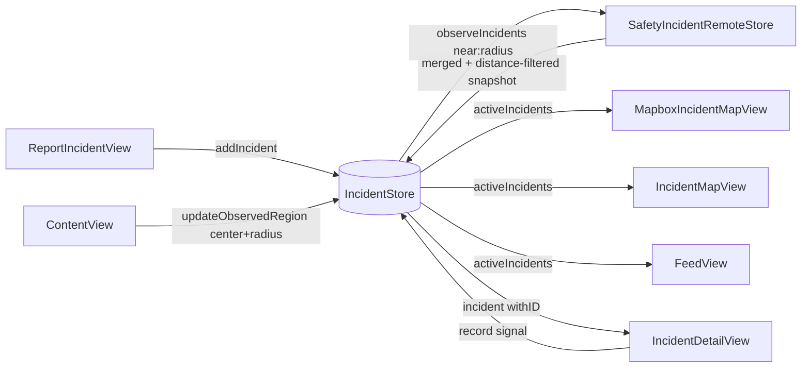
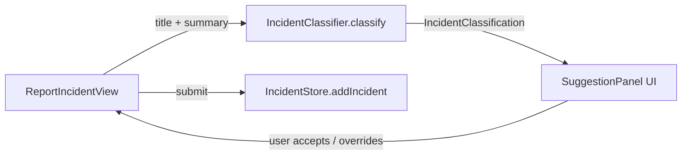

# PulseTrackr — Project Wiki

> Community safety incident reporter. Crowd-sourced reports, geo-bounded real-time map, Firebase backend. Built for global (multi-region) release: incidents are queried by proximity to the user, distances and copy localize per locale.

---

## Table of Contents

1. [Architecture Overview](#1-architecture-overview)
2. [Component Relationship Map](#2-component-relationship-map)
3. [File Reference](#3-file-reference)
4. [Data Model](#4-data-model)
5. [Data Flow](#5-data-flow)
6. [Shared State (AppStorage)](#6-shared-state-appstorage)
7. [Duplication & Efficiency Notes](#7-duplication--efficiency-notes)
8. [SOS Backend & Privacy Contract](#8-sos-backend--privacy-contract)
9. [Geo-scaling, Units & Localization](#9-geo-scaling-units--localization)

---

## 1. Architecture Overview

```
App Entry
  └── pulsetrackrApp          → boots Firebase → ContentView

ContentView (root)
  ├── owns IncidentStore      → injected to all tabs via .environmentObject
  └── tabs: Map | Feed | Report | Settings
        ├── PulseMapView      → delegates to Mapbox or Apple map
        ├── FeedView          → draggable sheet + embedded map
        ├── ReportIncidentView
        └── SettingsView

Data Layer
  ├── Incident.swift          → domain model (all enums + struct; optional coordinate)
  ├── IncidentStore           → @MainActor ObservableObject, CRUD, geo-region subscription
  ├── SafetyIncidentRemoteStore → Firestore geohash-bounded listeners + Functions submit
  ├── Geohash.swift           → standard geohash encode + neighbour/covering-cell logic
  ├── SOSRemoteStore / SOSStore → Firebase Functions SOS activate/update/resolve + queue
  ├── SOSTrustedContact       → local trusted-contact model + Keychain helper
  ├── SOSPrivacyPolicy        → client-side SOS sharing limits
  ├── IncidentClassifier      → keyword-based auto-classification
  ├── LocationManager         → shared CLLocationManager wrapper (persists last-known)
  └── MapDefaults             → shared initial-camera logic (last-known / world view)

External
  ├── Firebase Auth           → anonymous sign-in before submissions
  ├── Firebase Firestore      → safety_incidents_public (geohash prefix-range listeners)
  ├── Firebase Functions      → submit_incident (writes geohash) + SOS callables
  ├── Firebase Storage        → incident photo/voice evidence, scoped to reporter uid
  ├── Twilio / SendGrid       → optional trusted-contact SOS delivery providers
  └── Mapbox Maps SDK         → conditional compile (#if canImport(MapboxMaps))

Localization
  └── Localizable.xcstrings   → String Catalog (en source; es wired as example)
```

---

## 2. Component Relationship Map

### Ownership & Injection

```mermaid
graph TD
    App[pulsetrackrApp] -->|init| FB[FirebaseBootstrap]
    App -->|WindowGroup| CV[ContentView]

    CV -->|@StateObject owns| IS[IncidentStore]
    IS -->|optional dep| RS[SafetyIncidentRemoteStore]
    RS -->|uses| FB
    RS -->|Firebase Auth| Auth[Anonymous sign-in]
    RS -->|Firestore| FS[safety_incidents_public]
    RS -->|Functions| FN[submit_incident]
    SOSRS[SOSRemoteStore] -->|uses| FB
    SOSRS -->|Firebase Auth| Auth
    SOSRS -->|Functions| SOSFN[activate_sos / append_sos_location / resolve_sos]

    CV -->|@StateObject owns| LM[LocationManager]
    CV -->|.environmentObject| PMV[PulseMapView]
    CV -->|.environmentObject| FV[FeedView]
    CV -->|.environmentObject| RIV[ReportIncidentView]
    CV -->|.environmentObject| SV[SettingsView]
    CV -->|.environmentObject| LM

    PMV -->|#if Mapbox| MIMV[MapboxIncidentMapView]
    PMV -->|#else| IMV[IncidentMapView]
    FV -->|#if Mapbox| FML[FeedMapboxLayer]
    FV -->|#else| AppleMap[Apple Map inline]

    MIMV -->|NavigationLink| IDV[IncidentDetailView]
    IMV  -->|NavigationLink| IDV
    FV   -->|NavigationLink| IDV
```

### Read / Write on IncidentStore



### Classification Pipeline



`IncidentClassifier` is an **ordered, first-match-wins** rule chain (the order
encodes curated priority, e.g. `flooded road` → traffic *before* weather; `bad road`
→ before crash). Matching uses **left word-boundary prefix** matching (`\bterm`), so
inflections still match (`kidnap` → `kidnapping`) while embedded words do not
(`fire` inside `ceasefire`). Phrase lists include Nigerian/Pidgin variants
(`dey burn`, `fire outbreak`, `don collapse`, `go slow`, `PHCN`, `gbomo gbomo`, …);
malls/plazas/complexes are checked before markets so a "shopping complex fire" maps
to Building fire, not Market fire. No new subtypes were added. Covered by
`ClassifierNigerianTests.swift` plus the existing regression/validation suites.

---

## 3. File Reference

| File | Role | Key Types | Reads | Writes |
|------|------|-----------|-------|--------|
| `pulsetrackrApp.swift` | App entry | `pulsetrackrApp` | — | calls `FirebaseBootstrap` |
| `FirebaseBootstrap.swift` | Firebase init guard | `FirebaseBootstrap` | Bundle plist | `FirebaseApp.configure()` |
| `ContentView.swift` | Root tab view; drives geo-region subscription from location + radius | `ContentView`, `AppTab` | `@AppStorage hasSeenLaunch/watchRadius`, `LocationManager` | calls `IncidentStore.updateObservedRegion`, `SOSStore.record` |
| `LaunchView.swift` | Onboarding splash | `LaunchView`, `FeatureRow` | — | `@AppStorage hasSeenLaunch` via callback |
| `PulseMapView.swift` | Map tab facade | `PulseMapView` | — | — |
| `MapboxIncidentMapView.swift` | Map (Mapbox) | `MapboxIncidentMapView` + 4 private views | `IncidentStore`, `LocationManager`, `@AppStorage watchRadius/urgentAlerts/communityAlerts` | — |
| `IncidentMapView.swift` | Map (Apple) | `IncidentMapView` + 5 private views | `IncidentStore`, `LocationManager`, `@AppStorage watchRadius/urgentAlerts/communityAlerts` | — |
| `FeedView.swift` | Feed tab + sheet | `FeedView` + 9 private views | `IncidentStore`, `LocationManager`, `@AppStorage watchRadius/urgentAlerts/communityAlerts` | — |
| `FeedMapboxLayer.swift` | Mapbox layer for Feed | `FeedMapboxLayer`, `FeedMapboxPin` | `[Incident]` passed in | — |
| `IncidentDetailView.swift` | Incident detail | `IncidentDetailView` + `detailPanel()` modifier | `IncidentStore.incident(withID:)` | `IncidentStore.record(_:for:)` |
| `ReportIncidentView.swift` | Report new incident — **single unified form** (text + optional photo + optional voice + ongoing/past toggle, all submitted together) | `ReportIncidentView` + private views (`ReportComposer`, `StatusPill`, `SuggestionPanel`, …) | `LocationManager`, `IncidentClassifier`, `@AppStorage useApproximateLocation` | `IncidentStore.addIncident(...)` |
| `SettingsView.swift` | Settings | `SettingsView` + private views incl. `PrecisionLocationRow` | `@AppStorage` (4 keys), `LocationManager` (auth + accuracy), `SOSStore` | `@AppStorage` (4 keys) |
| `Incident.swift` | Domain model | `Incident`, `IncidentCategory`, `IncidentSubtype`, `IncidentSeverity`, `IncidentStatus`, `IncidentConfidence`, `CommunitySignal`, `IncidentUpdate` + `CLLocationCoordinate2D` extensions (`pulseDefaultCenter`, `isValid`, locale-aware distance) | — | — (value types) |
| `IncidentStore.swift` | State manager + geo-region subscription | `IncidentStore`; `Incident.seedIncidents` is **`#if DEBUG` only** (previews) | `SafetyIncidentRemoteStore` (optional) | self: in-place O(1) mutation via `lookup[UUID:Int]`; `@Published lastSyncError` |
| `SafetyIncidentRemoteStore.swift` | Firebase integration; geohash-bounded feed | `SafetyIncidentRemoteStore`, `SafetyIncidentRemoteStoreError` | Firestore `safety_incidents_public` via per-prefix `geohash` range listeners | Firestore via `submit_incident` Function; Storage evidence |
| `Geohash.swift` | Geohash encode + neighbour/covering-cell + radius→precision | `Geohash` (enum) | — | — (pure) |
| `MapDefaults.swift` | Shared initial-camera logic | `MapDefaults` | `LocationManager.lastKnownCoordinate` | — |
| `SharedComponents.swift` | Reusable UI: `cardPanel()`, `CategoryChip`, `LocationPromptCard` | view modifier + 2 views | `CLAuthorizationStatus` | opens Settings / requests permission |
| `AppStorageKey.swift` | Centralized `@AppStorage` key names | `AppStorageKey` enum | — | — |
| `SOSStore.swift` | SOS session/trail state machine + upload queue | `SOSStore` | `SOSRemoteStore`, `SOSTrustedContactStore`, `SOSPrivacyPolicy` | enqueues + syncs SOS events; `@Published` errors |
| `Localizable.xcstrings` | String Catalog (en source; es example) | — | resolved by `Text`/`LocalizedStringKey` | — |
| `functions/src/geohash.js` | Server geohash encoder (matches `Geohash.swift`) | `encodeGeohash` | lat/lon | `geohash` field on public incidents |
| `storage.rules` | Storage access rules | — | Auth uid | reporter-owned image/audio only, ≤10 MB |
| `SOSRemoteStore.swift` | SOS Firebase Functions API | `SOSRemoteStore`, `SOSActivationPayload`, `SOSLocationUpdatePayload`, `SOSResolutionPayload` | Firebase configured state | Functions `activate_sos`, `append_sos_location`, `resolve_sos` |
| `SOSTrustedContact.swift` | Local SOS contacts | `SOSTrustedContact`, `SOSTrustedContactStore`, notification target payloads | Keychain generic password item | Keychain generic password item |
| `SOSPrivacyPolicy.swift` | SOS sharing limits | `SOSPrivacyPolicy`, `SOSPayloadCoding` | — | — |
| `firebase.json` | Firebase backend config | Functions, Firestore, emulator config | — | deploy/emulator behavior |
| `firestore.rules` | Firestore access rules | server-only SOS collections | Auth/custom claims | denies raw SOS client reads |
| `functions/src/index.js` | SOS Cloud Functions | `activate_sos`, `append_sos_location`, `resolve_sos`, `request_sos_session_access` | callable payloads | private SOS collections |
| `functions/src/sosShared.js` | SOS backend validation helpers | payload sanitizers, idempotency helpers | callable payloads | pure values |
| `functions/src/notificationProviders.js` | SOS notification adapters | Twilio SMS/voice, SendGrid email | provider secrets | provider delivery APIs |
| `IncidentClassifier.swift` | Text classification | `IncidentClassifier`, `IncidentClassification` | title + summary strings | — (pure function) |
| `LocationManager.swift` | Location wrapper | `LocationManager` | `CLLocationManager` | publishes `currentCoordinate`, `authorizationStatus`, `accuracyAuthorization` (full vs reduced); persists last-known coord to `UserDefaults` |

---

## 4. Data Model

### Core Struct

```
Incident
 ├── id: UUID
 ├── title, summary, neighborhood: String
 ├── category: IncidentCategory   → color, icon, label
 ├── subtype: IncidentSubtype     → category, label, icon, isAlwaysHighRisk
 ├── severity: IncidentSeverity   → low / medium / high / urgent
 ├── status: IncidentStatus       → active / watching / resolved
 ├── coordinate: CLLocationCoordinate2D?  (fuzzy public coord; nil = location not shared)
 ├── reporterCoordinate: CLLocationCoordinate2D?  (exact, private)
 ├── reportedAt: Date
 ├── confirmations, disputes, unsafeReports, blockedReports, clearedReports, officialUpdates: Int
 └── updates: [IncidentUpdate]    → { id, message, timestamp }
```

### Computed Properties on Incident

| Property | Logic |
|----------|-------|
| `confidence` | officialUpdates>0 → `.officialUpdate`; confirmations≥8 && disputes<confirmations → `.communityVerified`; confirmations≥2 or unsafe/blocked → `.multipleReports`; else → `.unconfirmed` |
| `isHighRisk` | severity == .urgent/.high OR subtype.isAlwaysHighRisk OR unsafeReports > 0 |
| `alertTone` | resolved → "No longer active"; isHighRisk → "Nearby alert sent"; else → "Live local report" |
| `signalSummary` | "X seen • X not seen • X unsafe • X cleared" |
| `hasLocation` | `coordinate?.isValid == true` — gates map pins and the directions UI |
| `googleMapsAreaURL` / `googleMapsDirectionsURL` | Built with `URLComponents` (no force-unwrap); fall back to the default center only when location is unknown (and the directions UI is hidden in that case) |

> **Note:** `coordinate` is optional. A report submitted with no location stores `nil` (it still appears in the feed, but is not pinned on the map and shows no distance/directions). The remote decoder also yields `nil` when a doc has no `latitude`/`longitude`, rather than fabricating a default pin. The public `coordinate` is also written with a `geohash` server-side for proximity queries (see §9).

### Category → Subtype Hierarchy

```
security   → armedRobbery, kidnapping, gunshots, carjacking, oneChance,
             suspiciousActivity, checkpointIssue, communalClash
traffic    → crash, roadblock, gridlock, floodedRoad, badRoad, brokenDownVehicle
fire       → buildingFire, marketFire, gasLeak, explosion, electricalFire, pipelineFire
medical    → medicalEmergency, suspectedOutbreak, hospitalIssue, medicineShortage,
             contaminatedWater, foodPoisoning
weather    → flooding, heavyRain, stormDamage, erosionLandslide, droughtWaterScarcity
utilities  → powerOutage, waterOutage, fuelScarcity, bridgeDamage, railIssue
structure  → buildingCollapse, bridgeCollapse, roadCollapse, unsafeBuilding, fallenPowerLine
community  → missingPerson, localWarning, safeRoute, communityWatch,
             publicGathering, aidNeeded
```

**urgentTypes** (trigger urgent alert toggle): `security`, `fire`, `medical`  
**communityTypes** (trigger community alert toggle): `traffic`, `utilities`, `community`, `weather`, `structure`

---

## 5. Data Flow

### Reporting an Incident

One form collects everything at once — title/description, an optional photo, an
optional voice note, and an "Is this still happening?" choice (Happening now →
`status .active`; Already happened → `.watching`). The classifier suggestion panel
sits beneath and can be accepted or overridden. All filled inputs are merged into a
single `addIncident` call.

```
User types title/summary
  → IncidentClassifier.classify(title:summary:)        [pure, keyword match]
  → SuggestionPanel shows auto-classification
  → user accepts or manually overrides category/subtype/severity
  → LocationManager.currentCoordinate captured
  → IncidentStore.addIncident(...)
      ├── publicCoordinate = exact ? fuzz(exact, 140–260m offset) : nil   (no fake pin)
      ├── append to incidents array (O(1) amortized)
      ├── update lookup[UUID → index]
      └── if remoteStore: Task { ... }
            ├── (best-effort) uploadIncidentEvidence(...)
            ├── retrying(3×, backoff) { submitIncident(...) }   ← no silent try?
            │     ├── ensureSignedIn() → Firebase anonymous auth
            │     └── functions.httpsCallable("submit_incident").call(payload)
            └── on failure → set IncidentStore.lastSyncError (surfaced to UI)
```

### Remote Sync (geohash-bounded listeners)

The feed is **proximity-bounded** — it no longer streams every incident worldwide
(critical for a global release). See §9 for the geohash mechanics.

```
ContentView (on location fix or watchRadius change)
  └── IncidentStore.updateObservedRegion(center:, radiusKm:)   [re-subscribes if moved >500m or radius changed]
        └── SafetyIncidentRemoteStore.observeIncidents(near:, radiusMeters:) { incidents in }
              ├── Geohash.coveringPrefixes(center, radius)  → centre cell + 8 neighbours
              └── one snapshot listener per prefix:
                    safety_incidents_public
                      .order(by: geohash).start(at: prefix).end(before: prefix+"~").limit(200)
                  → on any listener change:
                      merge buckets → filter (active/watching AND distance ≤ radius) → sort by date
                      → replaceIncidents(...)  → rebuildLookup() [O(n)]

No location yet / permission denied → no subscription → empty feed + LocationPromptCard.
```

### Community Signal

```
IncidentDetailView → user taps signal button
  → IncidentStore.record(_:for:)
      ├── lookup[id] → index (O(1))
      ├── mutates incidents[index] in-place (no COW copy)
      ├── updates status, severity, counters
      └── prepends IncidentUpdate to updates[]
```

### Feed/Map Filtering Pipeline

```
(incidents already proximity-bounded server-side to the watch radius — see §9)
IncidentStore.activeIncidents          [status != resolved, sorted by date]
  → IncidentStore.nearbyIncidents(urgentAlerts:communityAlerts:watchRadius:near:)
       ├── classify: urgent = category ∈ urgentTypes OR incident.isHighRisk;
       │            community notice = (not urgent) AND category ∈ communityTypes
       ├── filter by urgentAlerts / communityAlerts (@AppStorage)
       └── filter by watchRadius * 1000m from locationManager.currentCoordinate
           (locationless incidents are excluded from the radius filter)
  → [FeedView] scope filter: all / priority / new / verified
  → [FeedView] category chip filter
  → [FeedView] search text filter (title, summary, neighborhood, category, subtype)

Distances shown to the user format per locale (m/km vs ft/mi) — see §9.
Map pins are only drawn for incidents with a non-nil coordinate.
```

---

## 6. Shared State (AppStorage)

These keys are read/written across multiple files. Changing a key name requires updating all sites.

| Key | Type | Default | Read by | Written by |
|-----|------|---------|---------|------------|
| `hasSeenLaunch` | Bool | false | `ContentView` | `ContentView` (via `LaunchView` callback) |
| `watchRadius` | Double | 3.0 | `FeedView`, `IncidentMapView`, `MapboxIncidentMapView`, `SettingsView` | `SettingsView` |
| `urgentAlerts` | Bool | true | `FeedView`, `IncidentMapView`, `MapboxIncidentMapView`, `SettingsView` | `SettingsView` |
| `communityAlerts` | Bool | true | `FeedView`, `IncidentMapView`, `MapboxIncidentMapView`, `SettingsView` | `SettingsView` |
| `useApproximateLocation` | Bool | true | `ReportIncidentView`, `SettingsView` | `SettingsView` |
| `lastKnownLatitude` | Double | — | `LocationManager.lastKnownCoordinate` (→ `MapDefaults`, map camera init) | `LocationManager` (on each GPS fix) |
| `lastKnownLongitude` | Double | — | `LocationManager.lastKnownCoordinate` (→ `MapDefaults`, map camera init) | `LocationManager` (on each GPS fix) |

> Key names are centralized in `AppStorageKey.swift`. `watchRadius` is stored
> canonically in **km**; the Settings label converts to mi for imperial locales.

---

## 7. Duplication & Efficiency Notes

### ✅ Resolved — Shared Filter Logic

The urgentAlerts + communityAlerts + watchRadius + distance filter now lives in
`IncidentStore.nearbyIncidents(urgentAlerts:communityAlerts:watchRadius:near:)`.
`FeedView`, `IncidentMapView`, and `MapboxIncidentMapView` all call that single
method, so filter changes propagate everywhere automatically.

---

### ✅ Resolved — Shared LocationManager

`ContentView` owns one `@StateObject private var locationManager = LocationManager()` and injects it as an environment object. `MapboxIncidentMapView`, `IncidentMapView`, `FeedView`, and `ReportIncidentView` read that shared instance instead of creating separate `CLLocationManager` wrappers.

---

### 🟡 Medium — Near-Duplicate Pin Views

`FeedMapboxPin` (`FeedMapboxLayer.swift`) and `MapboxIncidentPin` (`MapboxIncidentMapView.swift`) render the same pin design with slightly different sizing constants.  
`FeedMapPin` (`FeedView.swift`) and `LiveIncidentPin` (`IncidentMapView.swift`) are also near-identical for Apple Maps.

**Fix:** Consolidate into one `IncidentPin(incident:, style:)` view, parameterized by `PinStyle` enum (compact / standard / large).

---

### 🟡 Medium — Panel View Modifier Triplication

Three nearly identical `.background + .overlay(stroke)` modifiers exist as private extensions with different opacities:

- `detailPanel()` in `IncidentDetailView.swift` — 0.07 / 0.06
- `reportPanel()` in `ReportIncidentView.swift` — 0.09 / 0.06
- `settingsPanel()` in `SettingsView.swift` — 0.07 / 0.06

**Fix:** One shared `func cardPanel(backgroundOpacity: Double = 0.07)` view modifier in a shared file (e.g., `ViewModifiers.swift`).

---

### 🟡 Medium — CategoryChip Duplication

`CategoryChip` in `FeedView.swift` and `MapboxCategoryChip` in `MapboxIncidentMapView.swift` are the same component with only background color differences (white vs black).

**Fix:** One `CategoryChip(title:icon:color:isSelected:darkBackground:action:)` with a `darkBackground` bool.

---

### ✅ Resolved — `Incident.seedIncidents` no longer ships

Seed data was previously the production store's initial state (5 fake incidents
shown to every user on launch). It is now wrapped in `#if DEBUG` and used only by
SwiftUI previews via `IncidentStore.preview`. The production store starts **empty**
and fills from the geo-bounded remote listener. `#Preview` blocks that reference it
are themselves `#if DEBUG` (since `#Preview` macros compile into release builds).

---

### ✅ Resolved — Other audited items

- **No fabricated location.** `addIncident` and the remote decoder store `nil`
  rather than a default-city pin when no location is shared; pins/distance/directions
  gate on `coordinate`/`hasLocation`.
- **No silent network failures.** `submitIncident`/`recordSignal` retry with backoff
  and surface `IncidentStore.lastSyncError`; SOS `markNotified` failures surface via
  `trustedContactError` (previously `try?`-swallowed).
- **Magic coordinate de-duplicated** into `CLLocationCoordinate2D.pulseDefaultCenter`
  (now only a deep fallback; map cameras use `MapDefaults`).
- **Force-unwrapped Google Maps URLs** replaced with `URLComponents`.
- **`GoogleService-Info.plist` untracked** from git (`.gitignore` + committed
  `.example` template); protect the API key via Cloud Console restrictions + rules.

---

### 🟢 Low — `IncidentDetailView` Always Fetches Live Incident

`IncidentDetailView` takes an `Incident` parameter but immediately replaces it with `incidentStore.incident(withID:)` on every body evaluation. This is intentional for live updates but means the passed-in incident is only used as a fallback.

**Consider:** Passing only the UUID instead of the full `Incident` struct to make the intent clearer.

---

### Notes on What's Already Efficient

- `IncidentStore` uses `lookup: [UUID: Int]` for O(1) incident access — good
- In-place mutation via `objectWillChange.send()` + direct index access avoids copy-on-write overhead — good
- `SafetyIncidentRemoteStore.makeIfConfigured()` gracefully no-ops without Firebase plist — good
- `IncidentClassifier` is a pure function (no state) — good
- `FirebaseBootstrap` guards against double-configure — good

---

## 8. SOS Backend & Privacy Contract

SOS support is intentionally split from incident reporting. Trusted contacts are stored locally through `SOSTrustedContactStore`, and remote SOS calls are only available through `SOSRemoteStore.makeIfConfigured()` when `GoogleService-Info.plist` is present. That plist is **git-ignored** (each developer supplies their own; see `GoogleService-Info.plist.example` and `FIREBASE_SETUP.md`).

### Client payloads

`activate_sos` receives:

- `client_session_id`, `activated_at`, and `source`
- `last_known_location`
- privacy-capped `recent_trail`
- optional `direction_of_travel`
- `trusted_contacts_to_notify` for backend notification attempts
- `device` metadata where locally available, including battery, low-power mode, app/build, device/system, and optional network state
- `privacy` policy values that document client sharing limits

`append_sos_location` receives `session_id`, one location snapshot, sequence number, optional direction of travel, and current device metadata.

`resolve_sos` receives `session_id`, `resolution_reason`, `resolved_at`, and an optional final location.

### Backend collections

- `sos_sessions_private`: server-only active/resolved session records.
- `sos_location_updates_private`: server-only append-only live update records, with retention/TTL.
- `sos_notification_attempts_private`: trusted-contact notification attempts, updated with `sent`, `failed`, or `provider_unconfigured`.
- `sos_idempotency_private`: maps user + client session UUID to the canonical server session.
- `sos_rate_limits_private`: per-user activation cooldown/window tracking.
- `sos_access_grants_private`: short-lived privileged grants for authorized responder/admin flows.
- `sos_access_audit`: append-only audit events for admin, care-team, and law-enforcement access attempts.

### Access limits

Law-enforcement and admin access must be audited, time-limited, and restricted to active SOS sessions. PulseTrackr should not imply automatic law-enforcement dispatch. Any authorized responder access should happen through privileged backend code that verifies the session is active, returns only the minimum exact-location/contact data needed, records actor/reason/decision/expiry in `sos_access_audit`, and expires access unless the session remains active and policy allows renewal.

### Backend delivery implementation

The Firebase backend now lives in this repo:

- `firebase.json` configures Firestore rules/indexes, Storage rules, and local emulators for Auth, Functions, and Firestore.
- `firestore.rules` denies direct client access to raw SOS location/session/notification/idempotency/rate-limit collections. `safety_incidents_public` is client-readable but client-unwritable (writes go through `submit_incident`, which also stamps the `geohash`).
- `storage.rules` scopes incident evidence to `incident_reports/{uid}/…`: the owner may create image/audio ≤10 MB; everything else denied.
- `functions/src/index.js` implements callable SOS endpoints:
  - `activate_sos`: auth/App Check, idempotency, rate limits, server-side trail caps, private session write, audit write, notification queue + delivery attempt.
  - `append_sos_location`: auth/App Check, owner check, active/unexpired session check, idempotent sequence updates, append-only update records.
  - `resolve_sos`: auth/App Check, owner check, supported resolution reasons, idempotent resolution, audit write.
  - `request_sos_session_access`: custom-claim gated access for `sosAdmin`, `careTeam`, or `lawEnforcement`, active-session only, audited, short-lived grants.
- `functions/src/sosShared.js` keeps the validation logic pure and covered by `node --test`.
- `functions/src/notificationProviders.js` sends SMS/phone calls with Twilio and email with SendGrid when credentials are configured. Missing credentials are recorded as `provider_unconfigured`, never as a successful alert.

Production still needs provider secrets, sender verification, delivery-receipt monitoring, and a documented incident-response owner before any live SOS launch. The code path is now real, but operations must be real too.

### Firebase project state

The local Firebase CLI can see the `pulsetracker-0000` Firebase project, and `.firebaserc` maps `default`/`production` to that project. The live project currently has existing Python functions, so this repo uses the separate Functions codebase `pulsetrackr-sos` for SOS to avoid deleting or reconciling unrelated deployed functions. A deploy still requires intentional operator action:

```sh
firebase deploy --only functions,firestore:rules,firestore:indexes,storage
```

Before deploy, configure secrets with `firebase functions:secrets:set` for Twilio and SendGrid, then assign custom responder claims through `functions/scripts/setSosRoleClaim.js`.

---

## 9. Geo-scaling, Units & Localization

Groundwork for a public, multi-region release.

### Geo-bounded incident feed (geohash)

The app does **not** stream every incident worldwide. Each public incident carries a
standard geohash, and the client queries only the cells around the user.

- **Write side** — `submit_incident` stores `geohash` (precision 9) on each
  `safety_incidents_public` doc via `functions/src/geohash.js`. Byte-for-byte
  compatible with the client encoder in `app/Geohash.swift`.
- **Read side** — `Geohash.coveringPrefixes(lat, lon, radiusMeters)` picks a
  precision sized to the watch radius and returns the centre cell + its 8 neighbours.
  `SafetyIncidentRemoteStore.observeIncidents(near:radiusMeters:)` attaches one
  listener per prefix as a `geohash` range query `[prefix, prefix+"~")`, merges the
  buckets, then filters to the exact radius + active statuses on the client.
- **Re-subscription** — driven by `ContentView`; re-subscribes when the user moves
  >500 m or changes `watchRadius`.
- **Index** — orders by the single `geohash` field (auto-indexed). No composite
  index needed.
- **Backfill** — docs written before this change lack `geohash` and are skipped by
  geo-queries; backfill with `encodeGeohash(lat, lng)` if pre-existing public data.

> **⚠️ Deploy gotcha (client/backend version skew).** The client query is
> `order(by: "geohash")`, which Firestore **excludes any document missing that
> field** from. So the geo-feed only works once `submit_incident` is **deployed**
> (`firebase deploy --only functions:pulsetrackr-sos:submit_incident`) — shipping
> the app to TestFlight does *not* deploy the backend. Symptom of the skew: a
> reported incident never appears in the reporter's own feed/map because its doc has
> no `geohash`. Confirm by checking a doc in `safety_incidents_public` for a
> `geohash` field. `sanitizeIncidentPayload` now rejects missing, partial, or
> invalid coordinates rather than inventing a fallback pin.

**Data-visibility consequence:** users only see incidents within their watch radius
(default 3 km, max 15 km) of their *own* location. No cross-country data; users in
different cities see different alerts; two users share an alert only where their
radii overlap.

### Locale-aware units

`CLLocationCoordinate2D.formattedDistance`/`shortFormattedDistance` branch on
`Locale.current.measurementSystem` → m/km for metric, ft/mi for imperial. The
Settings watch-radius label converts km→mi for imperial locales (stored value stays
km).

### Localization

`app/Localizable.xcstrings` (String Catalog) is the translation source.
`SWIFT_EMIT_LOC_STRINGS = YES` auto-extracts literal `Text("…")` strings. English is
the development language; `es` is wired end-to-end as a worked example (a build
emits `es.lproj/Localizable.strings`). String *variables* must be typed
`LocalizedStringKey` to localize (see `LocationPromptCard`). Full migration is
incremental — see `LOCALIZATION.md`.

### Location permission & accuracy

`LocationManager` publishes `authorizationStatus` and `accuracyAuthorization`
(`.fullAccuracy` vs `.reducedAccuracy`). Settings → Privacy shows a
`PrecisionLocationRow` reflecting this (green when full accuracy, orange + a
Settings shortcut when reduced or unauthorized). Reduced accuracy still yields a
coarse coordinate (so the geo-feed works, just less precisely); only a *missing*
fix at report time (or denial) prevents reporting. The app disables report submit
until it has a current or last-known coordinate, and the backend rejects any report
without a valid lat/long pair.

### Initial map camera

All four maps share `MapDefaults`:
- Returning user (saved last-known location) → opens on that area at city zoom.
- Brand-new user (no saved location) → opens on a flat zoomed-out **world view**
  (not an arbitrary city), then animates to the user on first GPS fix.
- No location + permission undetermined/denied → `LocationPromptCard` overlay.

### Validation

- `pulsetrackrTests/GeohashTests.swift` — encoder round-trip, neighbour reciprocity,
  and full circle-coverage (no edge misses).
- `functions/test/geohash.test.js` — server encoder agrees with the client.
- `functions/test/geoQuery.emulator.js` (`npm run test:geo`) — end-to-end against the
  **Firestore emulator**: nearby active incidents returned, far/other-continent and
  resolved excluded, widening the radius pulls in the edge incident.
